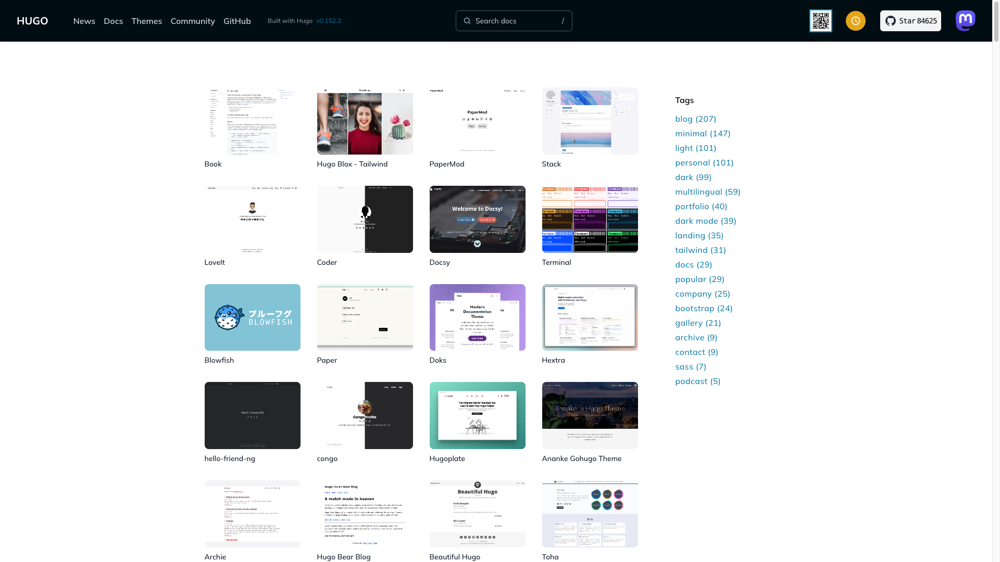
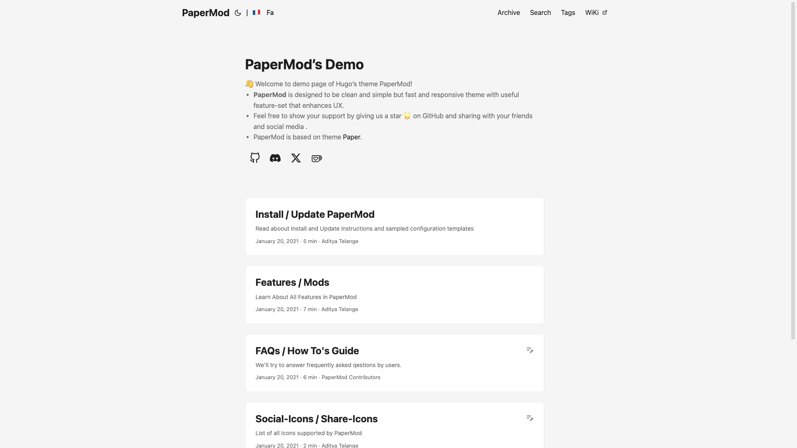
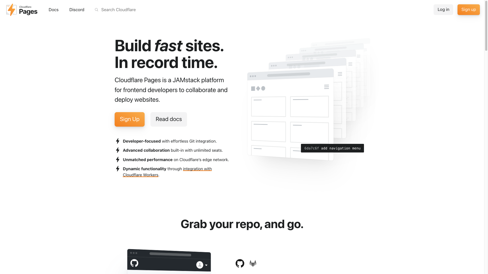

[지난 글](/2025/11/blog-start/)에서 Hugo를 선택한 이유를 적었다.
이번엔 실제로 만드는 과정을 적는다.

비개발자 입장에서 겪은 그대로 썼다.

## 시작하기 전에

필요한 것:

- 컴퓨터 (Mac 또는 Windows)
- 시간 30분
- Claude 또는 ChatGPT 구독 (선택)

전체 과정:

1. VSCode 설치 (5분)
2. Claude Code 설치 (5분)
3. Hugo 설치 + 테마 선택 (5분)
4. 첫 글 작성 (5분)
5. Cloudflare 배포 (10분)

## 1단계: VSCode 설치

[VSCode](https://code.visualstudio.com/)에 들어가서 다운로드 버튼을 눌렀다.
설치 파일을 실행하고 Next 몇 번 누르면 끝이다.

설치 후 실행하면 검은 화면이 나온다.
처음 보면 낯설다. 개발자용 도구니까.

근데 이걸 써야 한다.
Claude Code가 VSCode에서만 돌아가기 때문이다.

## 2단계: Claude Code 설치

VSCode 왼쪽 메뉴에서 Extensions (확장) 아이콘을 눌렀다.
검색창에 "Claude Code"를 쳤다.
Install 버튼을 누르면 설치된다.

Claude 구독이 있으면 무료로 쓸 수 있다.
ChatGPT 구독자는 "GPT Engineer"를 대신 설치하면 된다.

설치하면 아래쪽에 채팅창이 나타난다.
이제 여기에 한글로 물어보면 된다.

## 3단계: 테마 선택

글 쓰기 전에 테마부터 골라야 한다.

[Hugo Themes](https://themes.gohugo.io)에 들어갔다.
300개가 넘는 테마가 있다.



블로그용 테마를 몇 개 클릭해봤다.
나는 PaperMod가 마음에 들었다.



빠르고 깔끔하다.
다크모드도 기본으로 된다.

테마를 정했으면 이름을 외워둔다.
다음 단계에서 Claude Code한테 알려줘야 한다.

## 4단계: Hugo 설치

VSCode에서 폴더 하나를 만들었다.
File > Open Folder를 눌러서 빈 폴더를 선택했다.

이제 Claude Code한테 물어봤다.
"Hugo를 PaperMod 테마로 설치해줘. 난 비개발자야. 쉽게 설명해줘."

Claude Code가 자동으로 설치를 진행했다.
Homebrew를 먼저 깔고, Hugo를 깔고, 새 프로젝트를 만들고, PaperMod 테마까지 설치했다.

중간에 터미널에 명령어가 막 지나갔다.
무슨 소리인지 몰라도 상관없다.
Claude Code가 알아서 한다.

5분 지나니 "완료됐어요"라고 나왔다.

## 5단계: 로컬 서버 실행

Claude Code한테 "로컬 서버 실행해줘"라고 했다.

```bash
hugo server -D
```

이 명령어를 실행해줬다.

브라우저에서 `http://localhost:1313`을 열었다.
내 블로그가 떴다.

아직 글이 없어서 텅 비어있다.
근데 이게 내 블로그다.

파일을 저장하면 브라우저가 자동으로 새로고침된다.
실시간으로 확인하면서 작업할 수 있다.

## 6단계: 첫 글 작성

Claude Code한테 "테스트 글 하나 만들어줘"라고 했다.

파일이 생겼다.
`content/posts/첫-글/index.md`

파일을 열어보니 마크다운으로 돼있다.
`##` 이런 게 제목이고, `-` 이런 게 리스트다.

처음엔 낯설다.
근데 금방 익숙해진다.

중요한 건 내가 직접 마크다운을 쓸 일이 별로 없다는 거다.
Claude Code한테 "이 내용 추가해줘"라고 하면 알아서 써준다.

## 7단계: Front Matter 설치

이미지 넣는 게 불편했다.
이미지 파일을 폴더에 옮기고, 경로를 직접 써야 했다.

Claude Code한테 "이미지 넣기 편하게 하고 싶어"라고 했다.

"Front Matter 확장 프로그램을 설치하세요"라고 알려줬다.

VSCode 확장에서 "Front Matter"를 검색해서 설치했다.

이제 이미지를 Cmd+V(또는 Ctrl+V)로 붙여넣을 수 있다.
스크린샷 찍고 바로 붙여넣으면 파일명 물어본다.
이름 입력하면 자동으로 저장되고 경로도 들어간다.

확실히 편해졌다.

## 8단계: GitHub에 올리기

Claude Code한테 "이거 GitHub에 올리고 싶어"라고 했다.

GitHub 계정 주소를 물어봤다.
알려줬더니 알아서 git 설정하고 커밋하고 푸시까지 했다.

git이 뭔지 몰라도 상관없다.
Claude Code한테 시키면 된다.

## 9단계: Cloudflare Pages 배포

블로그를 인터넷에 올리는 단계다.

[Cloudflare Pages](https://pages.cloudflare.com/)에 들어가서 가입했다.
이메일 인증하고 로그인하면 끝이다.



"Create a project" 버튼을 눌렀다.
"Connect to Git" 옵션에서 GitHub를 선택했다.

GitHub 계정에 연결하면 내 저장소 목록이 나온다.
Hugo 프로젝트를 선택했다.

설정 화면이 나왔다.

- Build command: `hugo --minify`
- Build output directory: `public`

이 두 개만 입력하고 "Save and Deploy"를 눌렀다.

1분 정도 기다리니 "Success"가 떴다.
주소가 하나 나왔다.
`https://내프로젝트.pages.dev`

그 주소로 들어가니 내 블로그가 떴다.
인터넷에 올라간 거다.

## 10단계: 도메인 연결 (선택)

`내프로젝트.pages.dev` 주소가 마음에 안 들 수 있다.

도메인을 사고 싶으면 Cloudflare나 다른 곳에서 사면 된다.
1년에 1-2만원 정도다.

도메인을 샀으면 Cloudflare Pages 설정에서 "Custom domains"를 눌렀다.
"Add a custom domain"에 산 도메인을 입력하면 된다.

DNS 설정 두 줄 추가하라고 나온다.
그대로 따라하면 10분 안에 연결된다.

나는 `catmycat.com`으로 연결했다.

## 이제 뭐하지?

설정은 끝났다.

앞으로 할 일:

1. VSCode에서 글 쓰기
2. Claude Code한테 "커밋하고 푸시해줘"
3. 1-2분 후 자동 배포

끝이다.

## 실제로 쓰는 방법

내가 쓰는 워크플로우는 이렇다.

1. 아이디어 정리
2. Claude Code한테 "이 주제로 글 초안 써줘"
3. 초안 받아서 내 경험 추가하며 다듬기
4. 이미지 붙여넣기 (Cmd+V)
5. Claude Code한테 "SEO 체크해줘"
6. Claude Code한테 "커밋하고 푸시해줘"
7. 1-2분 후 블로그에 올라감

글 하나 쓰는데 20-30분 걸린다.
티스토리보다 빠르다.

## 진짜 비개발자도 가능할까?

가능하다.  
대 AI 시대 클로드나 GPT를 터미널에서 사용할 수 있으면 된다.

- 터미널 검은 화면 보고 겁먹지 않기
- Claude Code한테 막 물어보기
- 에러 나면 에러 메시지 복사해서 Claude Code한테 보여주기

중요한 건 AI한테 물어보는 걸 두려워하지 않는 거다.
모르는 거 있으면 바로 물어보자.

WordPress보다 훨씬 빠르고 가볍다.
플러그인 찾아 헤맬 필요도 없다.

한번 해보길 추천한다.
