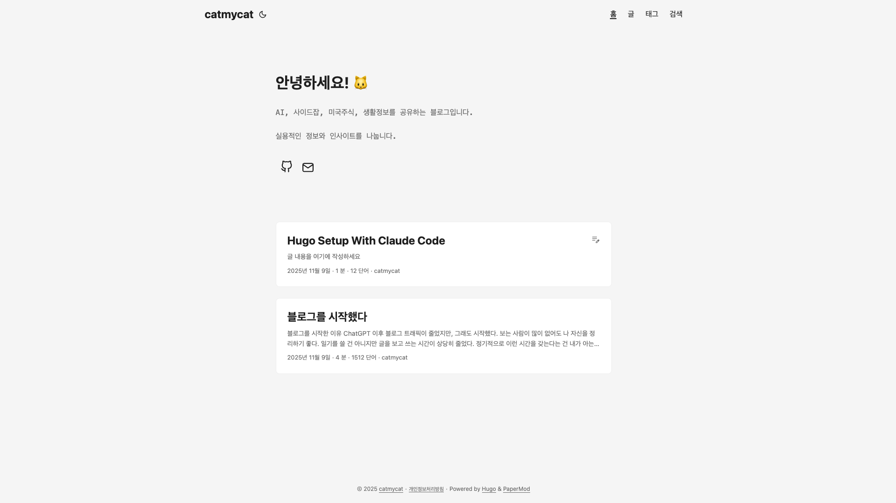
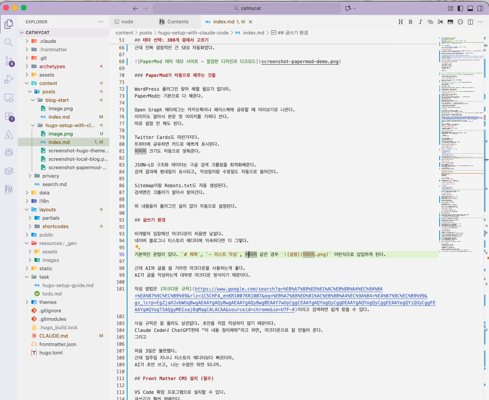

[지난 글](/2025/11/blog-start/)에서 Hugo를 선택한 이유를 적었다.
이번엔 실제로 어떻게 설정했는지 적어본다.

## 개발 환경 설정의 두려움

비개발자가 보통 셀프호스트 블로그를 한다고 하면, 워드프레스를 추천받는다. 하지만 만들고자 하는게 그렇게 대단한게 아니라 간단한 프로세스라면, [Hugo](https://gohugo.io/)로도 충분하다 생각한다.

Hugo를 추천할 수 있는 이유는 요즘 비개발자에게도 충분히 좋은 도구가 있기 때문이다.  
GPT 처럼 채팅을 통해 간단한 코딩을 할 수 있는 세상이다.

- [Cursor](https://cursor.com/): 좋은 UI를 제공. 단, 사용량 제한이 엄격.
- [Claude Code](https://www.claude.com/product/claude-code): 어려운 UI. 사용량 제한이 걸려도 충전됨. Claude 를 구독하고 있다면 무료로 사용 가능
- [Codex CLI](https://developers.openai.com/codex/cli/): 어려운 UI. 사용량 제한이 걸려도 충전됨. ChatGPT를 구독하고 있다면 무료로 사용 가능

난 Claude 를 사용중이기 때문이 Claude Code를 사용했다. "Hugo 블로그 시작하고 싶어" 로 시작하면 된다.

설정은 30분, 첫 배포는 1시간 정도 걸렸다.

## Hugo 설치와 첫 서버 실행

Claude Code에게 물어봤다.
"Hugo 블로그 어떻게 시작해?"

알아서 Homebrew로 설치하고,
새 프로젝트 만들고,
로컬 서버까지 띄워줬다.

```bash
hugo server -D
```

**앞으로 '로컬 서버'라는 곳에서 글을 쓰고 확인한 뒤, '커밋'과 '푸쉬'를 하면 글이 발행된다고 생각하면 된다.**



localhost:1313에서 바로 확인 가능했다. 저장하면 브라우저가 자동으로 새로고침됐다. 이제 로컬 서버는 에디터 미리보기가 된다.

## 테마 선택: 300개 중에서 고르기

[Hugo Themes](https://themes.gohugo.io)에 들어가봤다.
300개가 넘는 테마가 있다.


블로그, 포트폴리오, 문서 사이트.
용도별로 다양했다.

나는 PaperMod를 골랐다.

PageSpeed 95점 이상 나오는 속도가 마음에 들었다. 알고리즘님의 선택을 받기 좋아 보였다.

다크모드가 기본으로 지원되는 것도 좋았다.  
근데 진짜 결정적인 건 SEO 자동화였다.


### PaperMod가 자동으로 해주는 것들

WordPress 플러그인 찾아 헤맬 필요가 없더라.
PaperMod는 기본으로 다 해준다.

Open Graph 메타태그는 카카오톡이나 페이스북에 공유할 때 미리보기로 나온다.
이미지도 알아서 본문 첫 이미지를 가져다 쓴다.
따로 설정 안 해도 된다.

Twitter Cards도 마찬가지다.
트위터에 공유하면 카드로 예쁘게 표시된다.
이미지 크기도 자동으로 맞춰준다.

JSON-LD 구조화 데이터는 구글 검색 크롤링을 최적화해준다.
검색 결과에 썸네일이 표시되고, 작성일이랑 수정일도 자동으로 들어간다.

Sitemap이랑 Robots.txt도 자동 생성된다.
검색엔진 크롤러가 알아서 찾아간다.

위 내용들이 플러그인 설치 없이 자동으로 설정된다.

## 글쓰기 환경


비개발자 입장에선 마크다운이 처음엔 낯설다.
네이버 블로그나 티스토리 에디터에 익숙하다면 더 그렇다.

기본적인 문법이 있다. `# 제목`, `- 리스트 작성`, 이미지 같은 경우 `` 이런식으로 삽입하게 된다.

작성 방법은 [마크다운 규칙](https://www.google.com/search?q=%EB%A7%88%ED%81%AC%EB%8B%A4%EC%9A%B4+%EA%B7%9C%EC%B9%99&rlz=1C5CHFA_enKR1007KR1007&oq=%EB%A7%88%ED%81%AC%EB%8B%A4%EC%9A%B4+%EA%B7%9C%EC%B9%99&gs_lcrp=EgZjaHJvbWUqBwgAEAAYgAQyBwgAEAAYgAQyBwgBEAAY7wUyCggCEAAYgAQYogQyCggDEAAYgAQYogQyCggEEAAYogQYiQUyCggFEAAYgAQYogTSAQgyMDIxajBqMagCALACAA&sourceid=chrome&ie=UTF-8)이라고 검색하면 쉽게 찾을 수 있다.

사실 규칙은 잘 몰라도 상관없다. 초안을 직접 작성하지 않기 때문이다. Claude Code나 ChatGPT한테 "이런 글을 작성하려고 해"라고 하면, 마크다운으로 초안을 만들어 준다.

에디터에 민감한편이라, 사용하기 전엔 불편할 거라 생각했는데 환경을 만들고 나니 생각보다 너무 편하다. **자연스럽게 AI 와 내가 글을 함께 쓰는 환경이 만들어졌다.**

## Front Matter CMS 설치 (필수)

단, 마크다운으로 이미지 첨부는 불편할 수 있다. 이미지를 글과 같은 폴더에 옮기고 마크다운으로 경로를 지정해줘야 하기 때문이다. 이걸 편하게 해주는게 **Front Matter**다. VS Code 확장 프로그램으로 설치할 수 있다.

가장 좋은 건 이미지 붙여넣기다.

스크린샷을 Cmd+Shift+4로 찍고,
마크다운 편집기에서 Cmd+V로 붙여넣으면 파일명을 입력하라고 나온다.
입력하면 자동으로 저장되고 경로가 들어간다.

```markdown

```

### Claude Code가 SEO를 대신한다

진짜 장점은 여기서 나온다.

블로그 글 쓸 때마다 체크해야 할 게 많다:

- description 120-160자
- slug는 영문으로
- 이미지마다 alt 텍스트
- tags 3-5개
- 1200px 이상 이미지 리사이징

커밋 전에 Claude Code에게 물어보면 알아서 체크해준다.
description 빠졌으면 알려주고, 이미지 alt가 'image'로 돼있으면 구체적으로 바꿔준다.
이미지 크기가 2400px이면 리사이징도 제안한다.

## Page Bundle로 이미지 관리

Hugo의 콘텐츠 구조는 아래처럼 된다.

```
content/posts/my-post/
├── index.md
└── image.png
```

각 글이 폴더 단위다.
이미지를 같은 폴더에 저장한다.

나중에 CDN 이전할 때 경로 변경이 쉽더라.
글 하나가 하나의 패키지처럼 관리되니까 편하다.

### 커스텀 shortcode로 자동 최적화

``

이 한 줄이면:

- 1200px 이상 자동 리사이징
- WebP 변환 (용량 30-40% 감소)
- Lazy loading 자동 적용
- figcaption으로 이미지 설명 표시

첫 번째 글에 있던 2.4MB 이미지가 800KB로 줄었다.
페이지 로딩 속도가 눈에 띄게 빨라졌다.

## Cloudflare Pages 배포

GitHub 연결만 하면 끝이다.

Claude Code에게 'Cloudeflare Pages 에 배포하고싶다' 고 물어보면, 사이트 주소까지 알려주고 어떤 설정을 뭘로 바꿔야하는지 안내해준다.

무료 플랜으로 사용 가능하다. 단, 도메인을 사용하고 싶다면 구매해야한다. 개인 도메인이 있는건 전문적이라 판단해서 SEO 상 좀 더 유리하다고 알고있다. 난 도메인 하나를 구매했다.

도메인 연결도 쉽다.
Cloudflare에서 DNS 설정 두 줄 추가하면 끝.

이제 `git push`만 하면 자동으로 배포된다.

- 내 컴퓨터에서 글 작성
- git commit, push
- Cloudeflare Pages 에서 push 를 인식하고, deploy
- 새로운 글이 반영

## AI와 함께하는 글쓰기 환경

환경 구축 후의 진짜 장점이 여기 있다.

Hugo + Claude Code = 조사-작성-편집 자동화

완벽한 자동화라는건 아니다. 100% 자동화는 퀄리티가 떨어질 수 밖에 없다. **중요한건 AI 에게 지침을 추가해가면서, 손이 가는 시간을 줄일 수 있다는 것**이다.

`CLAUDE.md` 파일을 만들어서 지침을 넣어둘 수 있다. `글을 작성한 뒤, 묵독하는데 어색하지 않고 자연스럽게 다듬어줘`, `글을 작성한 뒤에 SEO에 부족한 부분이 있다면 너가 판단해서 채워줘` 규칙들을 하나씩 추가해두면 Claude Code는 모든 행동에 이 지침을 인식한다.

MCP로 확장도 가능하다.

Playwright MCP를 쓰면 스크린샷을 자동으로 찍을 수 있다.
이 글의 스크린샷도 Playwright로 자동 수집했다.

Filesystem MCP는 이미지 일괄 리사이징에 쓴다.
50개 이미지를 한번에 WebP로 변환할 수 있다.

GitHub MCP는 코드 예제를 실시간으로 가져온다.
최신 버전이 자동으로 반영된다.

실제 글쓰기 플로우는 이렇게 된다.

Claude Code에게 "블로그 글 초안 작성해줘"라고 한다.
Front Matter CMS로 이미지를 붙여넣는다.
Claude Code가 SEO 체크리스트를 점검한다.
git push 하면 Cloudflare Pages가 자동으로 배포한다.

### 실제 워크플로우

실제로 쓰는 워크플로우는 이렇다.

- 아이디어 정리
- Claude Code에게 전달. '이 아이디어로 글을 작성하고 싶어.'
- 초안 파일이 생성됨
- 필요한 이미지 삽입, 글 다듬기
- 커밋 전 클로드 코드에게 글 점검
- 푸쉬하면 자동으로 배포되고, 글이 올라감

## 비개발자도 가능할까?

배울게 하나도 없이 완벽하다면 거짓말이다. 그래도 작은 고통(?)으로 가능하다고 생각한다. 명령어는 Claude Code가 다 알려주고, Git 커밋도 대신해준다.

여기에 나오지 않은 내용은 Claude Code에게 직접 물어보면 된다. **중요한 건 AI에게 물어보는 걸 두려워하지 않는 거다.**

Claude Code 덕분에 아주 쉽게 블로그를 올렸다. Ghost CMS 같은 경우 Claude Code 를 사용해도 고려할게 많았다. 본인이 블로그를 통해 어떤걸 하려고 하는데 범위가 먼저 결정되는 게 중요한 것 같다.

결정되면 AI와 논의해보자.
